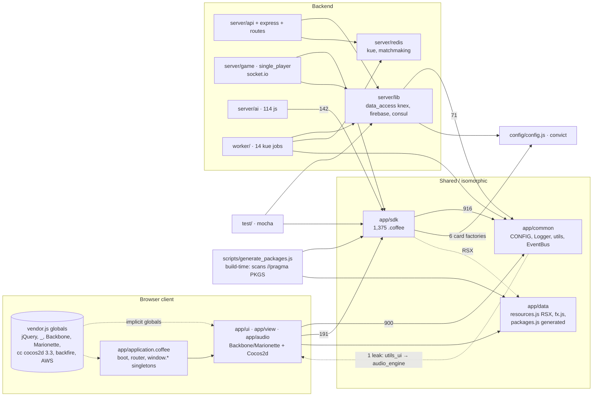
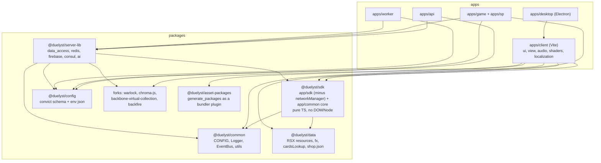

# OpenDuelyst — Modernization Audit

_Exploratory analysis of the codebase as of `2843f240` (Aug 2025), written to prepare a stack
modernization: pnpm monorepo, CoffeeScript → TypeScript, mocha → vitest, gulp/browserify → a modern
bundler, and (possibly) Playwright for end-to-end tests. Nothing in this document is implemented yet._

Numbers below were produced by scanning every `require()` / `import` in the repo (2,439 source files,
14,414 resolved edges) — vendored code, `node_modules`, `dist` and assets excluded.

---

## 1. At a glance

| Area                                                                               | Files                                    | Lines            | Language                   | Notes                                                                                                                                   |
| ---------------------------------------------------------------------------------- | ---------------------------------------- | ---------------- | -------------------------- | --------------------------------------------------------------------------------------------------------------------------------------- |
| `app/sdk` — game engine, shared client/server                                      | 1,375                                    | ~121k            | **100% CoffeeScript**      | 718 modifiers, 257 spells, 65 actions, 62 card-factory files                                                                            |
| `app/ui` + `app/view` + `app/audio` — Backbone/Marionette UI and Cocos2d rendering | 421 js + 6 coffee                        | ~150k            | JS (already decaffeinated) | 150 `.hbs`, 52 `.scss`, 96 `.glsl`                                                                                                      |
| `app/common` — CONFIG, logger, utils, event bus                                    | 18 js + 10 coffee                        | ~15k             | mixed                      | `config.js` is 1,380 lines of mutable global state                                                                                      |
| `app/application.coffee` + `register.coffee`                                       | 2                                        | 4.8k             | Coffee                     | boot, router, 20 singletons on `window`                                                                                                 |
| `server/` — API (Express), Game & SP (socket.io)                                   | 92 coffee + 206 js                       | ~49k             | mixed                      | `ai/` (114 js) and `migrations/` (86 js) done; `lib/data_access`, `routes`, `redis`, `game.coffee`, `single_player.coffee` still Coffee |
| `worker/` — Kue jobs                                                               | 29 coffee                                | ~3k              | Coffee                     |                                                                                                                                         |
| `test/`                                                                            | 137 js                                   | ~56k             | JS                         | mocha 10 + chai 3 (expect); no e2e at all                                                                                               |
| `packages/`                                                                        | 4 vendored libs                          | ~2.7k js + 24 ts |                            | `chroma-js` is TS, `warlock`, `backfire`, `Backbone.VirtualCollection`                                                                  |
| `desktop/`                                                                         | 5 js                                     | 0.6k             | JS                         | Electron shell that embeds `dist/src`                                                                                                   |
| `scripts/`, `cli/`                                                                 | 53 coffee + 12 js + sh/py                | ~9k              | mostly dead ops            | **`scripts/generate_packages.js` is build-critical**                                                                                    |
| Assets                                                                             | 6,303 png, 904 jpg, 734 m4a, 1,385 plist | 1.2 GB           |                            | `app/resources` 619 MB + `app/original_resources` 587 MB                                                                                |

Runtime: Node 24 (CI, Docker, local). Yarn 4.9.2 (Berry, `nodeLinker: node-modules`), no `workspaces`
field. Production containers **run `.coffee` directly through `coffeescript/register`** — there is no
compile step anywhere except the browser bundle.

A previous decaffeination effort was started and stalled: `bulk-decaffeinate.config.js`, root strict
`tsconfig.json` (compiles nothing today), `scripts/ts-progress-checker.py` (currently 71.8% js /
28.0% coffee / 0.13% ts by bytes — inflated by vendored code), and GitHub issue #4.

---

## 2. Dependency graph

### 2.1 Layer matrix (count of `require` statements, row → column)

```
from\to      client   common      sdk   server   worker     test  scripts   config
client         2134      900      191        0        0        0        0        1
common            3       28        2        0        0        0        0        0
sdk               1      916     7625        0        0        0        0        6
server           29*     171      245      745        2        0        0       54
worker            1*      30       14       56       17        0        0       24
test            124      247      114      191        0       98        0       26
scripts           9       47       16       69        2        0       12       36
```

`*` server/worker → "client" is entirely `app/sdk.coffee` (the SDK barrel, which sits at `app/`
root); there is **zero** server → `app/ui|view|audio` coupling.



### 2.2 Inside `app/sdk`

Outgoing edges per sub-area (self-edges removed):

| from                                                                               | to (count)                                                                                                    |
| ---------------------------------------------------------------------------------- | ------------------------------------------------------------------------------------------------------------- |
| `cards` (78 files)                                                                 | modifiers 1055, spells 402, common 148, entities 68, playerModifiers 51, artifacts 40, **config/config.js 6** |
| `modifiers` (718)                                                                  | actions 682, cards 412, common 343, playerModifiers 56, helpers 53                                            |
| `spells` (257)                                                                     | cards 246, actions 173, common 169, modifiers 124                                                             |
| `challenges` (57)                                                                  | actions 207, cards 105, common 59, sdk root 58, agents 52                                                     |
| `actions` (65)                                                                     | common 82, cards 26                                                                                           |
| `achievements`, `quests`, `progression`, `cosmetics`, `giftCrates`, `rank`, `rift` | meta-game; depend on cards + sdk root, not on modifiers/actions                                               |

Hub modules (in-degree across the whole repo): `app/common/config.js` 758, `app/common/logger.coffee`
630, `app/sdk/cards/cardType.coffee` 579, `app/sdk/modifiers/modifier.coffee` 379, `app/sdk.coffee`
323, `cardsLookupComplete.coffee` 308, `utils_game_session.coffee` 217, `event_types.js` 167,
`config/config.js` 161, `damageAction.coffee` 149.

Cycles: the SDK+common graph (1,404 files) has only **4 cyclic strongly-connected components**; the
big one is 58 files (30 modifiers, 18 cards, 8 spells, `gameSession`, `networkManager`). CommonJS
tolerates it today (`gameSession.coffee` defines the class first and requires at line 271+, the
"coderwall.com/p/myzvmg" idiom; managers in `app/ui` do `module.exports = X` before their requires).
`server/` has **zero** cycles.

Isomorphism: `app/sdk` has one `window.` reference (`networkManager.coffee:68`), zero `cc.`/`$`, three
`process.env` reads (`networkManager`, `card.coffee:999`). Extract `networkManager` and `app/sdk` is a
pure platform-free package.

### 2.3 External dependency usage by layer

| layer  | top npm deps (require count)                                                      |
| ------ | --------------------------------------------------------------------------------- |
| sdk    | i18next 345, underscore 260, moment 102                                           |
| client | underscore 95 (also a global!), bluebird 94, i18next 79, moment 64, firebase@2 8  |
| server | underscore 85, bluebird 60, moment 49, express 39, tcomb-validation 30, colors 24 |
| worker | bluebird 17, kue 6                                                                |
| test   | chai 129, coffeescript/register 133, app-module-path 129, sinon 15 (never called) |

---

## 3. Findings per area

### 3.1 `app/sdk` (the migration's center of gravity)

- Uniform shape: 1,371 files end in a single `module.exports = Class`. 1,167 `class X extends Y`.
  Base classes: Modifier 183, Spell 106, ModifierOpeningGambit 71, Achievement 57, Challenge 52, …
- ~600 of the 718 modifiers are 20-line declarative leaves (dual `type:` / `@type:` + `attributeBuffs`).
  These convert mechanically.
- Card factories (`cards/factory/<set>/<faction>.coffee`, e.g. `core/neutral.coffee` 3,568 lines) are
  one giant `@cardForIdentifier` with hundreds of `if identifier == Cards.X` blocks. Stats/i18n/RSX
  half is JSON-extractable; modifier wiring (`createContextObject`) must stay code. Every factory
  header says "do not add this file to a package / it is parsed by the package generation script".
- CoffeeScript hazards for TS: **51 bare `super`** (implicit arg forwarding), **`@type` static vs `type:`
  prototype property with the same name** (`modifier.coffee:24-25`, needed by `ModifierFactory`
  dispatch), ~60 mutable prototype defaults per big class, ~1,060 comprehensions, 320 `?.`, 192 `?=`,
  ~700 postfix `x?`, implicit returns. Fat arrows are rare (5), no mixins, no `eval`.
- **Serialization is structural**: `SDKObject` hides `_private` via `defineProperty` and rehydrates with
  `fastExtend(this, data)`. Moving prototype defaults to TS instance fields changes the wire format and
  breaks replays — needs a golden-file test before touching `modifier.coffee` / `card.coffee`.
- 495 JSDoc blocks / 444 `@param` tags already exist — seed for types.
- Coupling to break: card factories require `config/config.js` (server convict) and `app/data/resources`.

### 3.2 Browser client

- Boot: `index.coffee` → i18next promise → `application.coffee` (3,973 lines): Marionette app on the
  **global** `Backbone`, ~140 requires, ~25 things mirrored on `window`, WebGL probe, Firebase
  min-version check, `App.start()`; Cocos boots via `Scene.setup()`.
- Vendor globals (concatenated, never required): jQuery 2.1, velocity, bootstrap 3 JS, underscore 1.6,
  Backbone 1.1.2, backfire, Marionette 2.2.2, jQuery UI, `ccConfig.js`, **cocos2d-js 3.3-beta0**,
  aws-sdk. `cc.` appears **6,796** times (195/223 files in `app/view`); `Backbone` bare 335 times.
  `app/view/extensions/*Injections.js` monkey-patch cocos internals.
- Module system: 3,847 requires; 2,558 root-absolute `app/...` (browserify `paths`), 868 relative,
  150 `.hbs` (hbsfy), 112 `glslify('...')` **call expressions** (not requires), 11 `.json`,
  **0 dynamic requires**. 195 requires into `app/sdk` (154 via the barrel).
- envify vars: `API_URL` 149, `FIREBASE_URL` 72, `VERSION` 12, `NODE_ENV` 9, `AI_TOOLS_ENABLED`,
  `RECORD_CLIENT_LOGS`, `ALL_CARDS_AVAILABLE`, `INVITE_CODES_ACTIVE`, `RECAPTCHA_*`, `BUGSNAG_*`, …
  `progression_manager.js:16` pulls `config/config.js` (server convict) into the browser bundle.
- Assets: `app/data/resources.js` (RSX, 1.5 MB literal map) → paths resolved at runtime by `cc.loader`;
  CDN rewriting is a **regex over built JS/CSS** (`gulp/rsx.js buildUrls`, `rework-plugin-url`).
  `CONFIG.RESOURCE_SCALES=[2]` must match `$resourceScales` in SCSS.
- Localization: i18next XHR-loads `resources/locales/{lng}/index.json` from `dist` at runtime;
  `gulp/localization.js` writes the merged `en/index.json` **back into the source tree**.
- 20 manager singletons (`app/ui/managers/*`, `getInstance()` + `window.X`), `CONFIG` mutable
  singleton, `EventBus`, `Scene`, `FX`, `audio_engine`, `Session`.
- Second entry: `register.coffee` (standalone registration page, own bundle).

### 3.3 Backend

- `bin/{api,game,single_player,worker,workerui}` all: `app-module-path` → `coffeescript/register` →
  `config/config` → main `.coffee`. `bin/api` sets `global.Promise = bluebird`.
- Big Coffee files: `data_access/users.coffee` 3,133, `inventory.coffee` 2,862, `single_player.coffee`
  2,148, `sync.coffee` 1,909, `game.coffee` 1,544, `rift.coffee` 1,472. `routes/api/me/qa.coffee` 1,249.
- Module resolution: 773 relative vs 23 absolute in server; 187 (sdk) + others carry explicit
  `.coffee` extensions (break on rename). `require-dir` autoloads `routes/`, `routes/api/me`,
  `routes/api/users`, `middleware/`.
- Data: knex 0.19 + pg 8, 86 CJS migrations, redis 2.8 (promisifyAll), kue 0.11 (37 `Jobs.create`
  sites, 13 job types), firebase-admin 11 (`duelyst_firebase_module`), consul (14 files),
  `@aws-sdk/client-s3` v3 in worker only.
- Legacy deps: bluebird 2 (73 sites), colors `*` (string monkey-patch), winston 2 + papertrail,
  node-uuid, express-jwt 6 + jsonwebtoken 5.4, request, helmet 0.8, tcomb, validator 3, moment 2.8.
- Config: convict 6, `config/{development,staging,production}.json`, ~50 keys; import has side effects
  (writes `process.env.ALL_CARDS_AVAILABLE`, prints a banner).
- Worker: 14 jobs registered explicitly in `worker.coffee`; 6 more files in `worker/jobs` are
  unregistered (dead?); `worker/jobs/index.coffee` is empty.
- Docker: 6 near-identical `node:24-bookworm-slim` images, `yarn install`, copy sources, run
  `.coffee` via register. Container is server-only (`.dockerignore` drops the client).

### 3.4 Tests & CI

- 137 files: `unit` 102 (~38k lines; `sdk/{cards,game,ai,challenges,progression}`, `firebase`, `misc`,
  `session`), `integration` 23 (~16k), `rest` 5 (broken), `perf` 3 (Benchmark.js, not mocha), `utils` 3.
  ~2,025 active `it`s.
- Style: chai `expect` only (129/137), no `should`/`assert`. sinon 1 imported in 15 files but never
  called; power-assert in one fully-commented file. `.mocharc.js` = `{reporter:'spec'}`, no global
  setup — every file repeats `app-module-path` + `coffeescript/register` (mixed depths of `../`).
- SDK unit tests: `UtilsSDK.setupSession()` + `SDK.GameSession.getInstance()` singleton; pure Node, no
  DOM. File-level parallelism OK, in-file concurrency not.
- Integration: needs Postgres, Redis, Firebase RTDB; CI runs **only `test:integration:misc`** (3 files
  needing nothing) with a fake `FIREBASE_URL`; `data_access/`, `achievements/`, `firebase/` (~13k
  lines) never run in CI — assume rot.
- **No e2e/browser tests of any kind.** The Cocos/Backbone client has zero coverage.
- vitest blockers/estimates: ~90% of unit tests run with near-zero edits _once CoffeeScript loads_
  (needs a Vite/vitest coffee plugin — `require.extensions` hooks don't apply); `app-module-path` →
  `resolve.alias`; 122 `this.timeout()` calls; 69 `done`-callback tests; `-t 1000` default timeout.
- CI: 6 workflows, node 24, `corepack enable` + `yarn workspaces focus`, `yarn tsc:chroma-js` before
  `yarn build`, `libpng-dev` apt dep, path filters. lint_coffee (`app server worker`), lint_js
  (airbnb-base + import + mocha, ~25 rules downgraded + 12 per-dir overrides), lint_terraform.

### 3.5 Build tooling (`gulp/`)

- **Needed for a dev build**: `bundler.js` (browserify + coffeeify + hbsfy + glslify + envify [+
  uglifyify]; entries `app/index`[, `app/tools/editor.coffee`]), `bundler.register.js`, `css.js`
  (dart-sass, autoprefixer, url rewrite), `html.js` (gulp-hb, injects version/cdn/gaId), `vendor.js`
  (concat 12 files), `rsx.js` `packages`+`copy`+`copyWeb`, `localization.js`, `clean.js`.
- **Deploy-only / dead**: `cdn.js` (S3), `revision.js` (gulp-rev), `git.js`, `docker.js`, `bump.js`,
  `shop.js` (fully dead, not imported), `rsx:*_urls`, `rsx:imagemin*` (asset authoring).
- `dist/src/{index.html,register.html,vendor.js,duelyst.js,register.js,duelyst.css,resources/**,
resources/locales/**}`, served in dev by `server/routes/public.coffee` via `express.static`.
- **`scripts/generate_packages.js`** (1,476 lines) is the hidden second bundler: registers coffee, loads
  SDK lookups + `app/data/{fx,resources,packages_predefined}`, text-scans 221 source files for
  `//pragma PKGS: a b c` and `RSX.x` references, validates asset formats, and emits the gitignored
  `app/data/packages.js` (`PKGS`, consumed by `PackageManager` for lazy loading and by `rsx:copy`).
  Any new bundler must keep or replace this.

### 3.6 `packages/` — the monorepo seed

Consumed as `"./packages/x"` relative deps (no `workspaces`, though CI uses `yarn workspaces focus`):

- `chroma-js` — TS (Razer Chroma), `dist` not committed → `yarn tsc:chroma-js` prebuild; required by
  **relative path** from `app/common/chroma.js` (bypasses the package name).
- `backfire` — dead Firebase 2.x ↔ Backbone binding; consumed twice (dep + `vendor.js` concat of `dist/`).
- `Backbone.VirtualCollection` — fork 0.6.6, own gulp 3 gulpfile, prebuilt files committed.
- `warlock` — redis lock, plain JS, mocha tests, used by `server/redis/r-tokenmanager.coffee`.

### 3.7 `desktop/`

Electron shell: `desktop.js` + `renderer-preload.js`, embeds `../dist/src` (ncp). devDep electron 21 but
`desktop/gulp/desktop.js:60` pins `electronVersion: '2.0.18'` for packaging; own `yarn.lock`;
`execSync('yarn install')` hardcoded; requires `NODE_ENV=staging|production`. No Steam SDK.

### 3.8 pnpm-specific gotchas

`resolutions.handlebars` → `pnpm.overrides`; `./packages/*` → `workspace:*` + `pnpm-workspace.yaml`;
`desktop/` separate lockfile; native builds (`bcrypt`, `pg`, `electron`, `imagemin-*`) need
`onlyBuiltDependencies`; stale `engines.yarn`; `.yarnrc.yml` is just `nodeLinker: node-modules`.

---

## 4. Implications for the modernization

### 4.1 Natural package boundaries (what the graph says)

The layering is already clean enough to cut along:



Things to untangle first (small, cheap, unblock the cut): `app/sdk/networkManager.coffee` (browser),
6 card factories + `progression_manager.js` requiring `config/config.js`, `app/common/utils/utils_ui.js`
→ `audio_engine`, `app/common/chroma.js` relative require of `packages/chroma-js`, `app/sdk.coffee`
barrel living outside `app/sdk`.

### 4.2 CoffeeScript → TypeScript

- Volume: ~1,580 files / ~175k lines of Coffee. `app/sdk` is 78% of that but is also the most
  mechanical (uniform class-per-file, 600 declarative leaves) and the best tested (99 unit files).
- Suggested order: enums/lookups (`cardType`, `factionsLookup`, `cardsLookup`…) → declarative
  modifiers/spells (scriptable) → `actions/` → `entities/` + `card.coffee` → `gameSession` last;
  server: `redis/` → `routes/` → `data_access/` → the two socket servers.
- Prefer decaffeinate → JS (already proven in `app/ui`, `app/view`, `server/ai`) → rename to `.ts` with
  loose `tsconfig` first; the root strict tsconfig is a target, not a starting point.
- Guard rails needed before touching core classes: golden-file serialization tests
  (`GameSession.serializeToJSON` round-trip, replays), and a test that `Factory.type` dispatch still
  works when statics/prototype props are split.
- Both `.coffee` and `.ts` must coexist for a long time on the server too: production runtime is
  `coffeescript/register`, so a TS server needs a real build (`tsc`/`tsup`/`tsx`) and Docker changes.

### 4.3 Bundler (browserify/gulp → Vite or similar)

Must provide: root alias `app/*` (2,558 imports), `.coffee` transform (until conversion is done),
`.hbs` precompile (150), glslify **call** transform (112, or codemod to `?raw`/glsl imports),
`define` for the envify vars, SCSS with `app/vendor` + `node_modules` include paths, the vendor
globals (keep `vendor.js` as a plain `<script>` or shim `jquery`/`backbone`/`cc` as externals),
`index.hbs` templating, locale merge, `PKGS` generation, asset copy from `app/resources` (619 MB —
keep out of the bundle graph), and a runtime CDN base URL instead of regex rewriting.
The CJS "export before require" singleton idiom will not survive ESM — convert managers/GameSession
to plain module singletons as part of the TS pass.

### 4.4 Tests

- vitest: alias + coffee plugin + `testTimeout: 1000` + convert `this.timeout` (122) and `done` (69);
  drop sinon 1 imports (unused), power-assert, `test/index.js`; exclude `test/perf`.
- Integration suite is largely unverified today — treat as a separate lower-confidence track.
- Playwright: there is nothing to migrate; if wanted it's greenfield (a WebGL Cocos canvas + Marionette
  DOM — DOM parts testable, canvas parts only via screenshots/game-state hooks like `window.SDK`).

### 4.5 Suggested first steps (not done yet)

1. `corepack enable && yarn && yarn tsc:chroma-js && FIREBASE_URL=https://x.firebaseio.com/ yarn build`
   and `yarn test:unit` to establish a green baseline (nothing is installed on this machine yet).
2. Introduce `pnpm-workspace.yaml` with the current tree unchanged (root + `packages/*` + `desktop`),
   fix `resolutions`/`file:` deps, get CI green on pnpm — before any file moves.
3. Add vitest alongside mocha for `test/unit/sdk` with a coffee plugin; run both until parity.
4. Extract the small couplings in §4.1, then move `app/sdk` + `app/common` to `packages/sdk`.
5. Vite for `apps/client` with a coffee plugin, keeping gulp only for asset/PKGS steps until replaced.
6. decaffeinate + TS per §4.2 order, server last.
